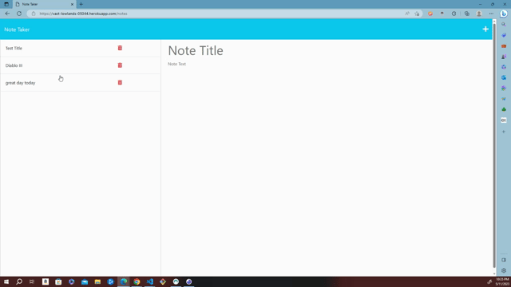

# Note Saver

    
  
  ## Table of Contents
  - [Project Description](#description)
  - [Usage](#usage)
  - [Installation](#installation)
  - [Contribution](#contribution)
  - [Questions](#questions)
  - [License](#license)
  - [Test](#test)

  ## Description
  To be able to create, edit and delete notes

  ## Usage
  The user will be able create notes and keep track of activites they hope to accopomplish

  ## Installation
  Run the installation file

  ## License
  

  ## Questions
  -https://github.com/J-Alph

  https://github.com/J-Alph/Notes-for-Thought
  
  ## Contribution
  n/a

  ## Test
  n/a

 
